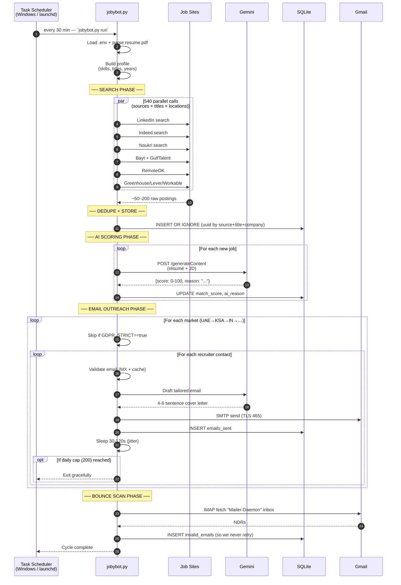

# JobyBots — System Architecture

> Plain-English explanation followed by deep technical diagrams. Read the
> first section if you just want to understand *what* runs on your laptop;
> read the rest if you want to know *how*.

---

## 1. The 30-second version

JobyBots is **one Python process** that runs on your laptop and does
six things, on a loop, every 30 minutes:

```
┌────────┐    ┌────────┐    ┌────────┐    ┌────────┐    ┌────────┐    ┌────────┐
│ Search │ →  │  Score │ →  │ Find   │ →  │ Tailor │ →  │ Validate│ →  │  Send  │
│ 8 sites│    │ w/ AI  │    │ email  │    │ letter │    │ email   │    │  + log │
└────────┘    └────────┘    └────────┘    └────────┘    └────────┘    └────────┘
```

Everything happens on your machine. Your résumé, Gmail password, and
Gemini API key never leave your project folder.

---

## 2. High-level architecture

```mermaid
graph TB
    subgraph YourLaptop["🖥️ YOUR LAPTOP  (everything sensitive lives here)"]
        ENV[.env<br/>Gmail App Password<br/>Gemini Key<br/>Your name+phone]
        RES[resume.pdf]
        DB[(SQLite<br/>data/jobybot.db)]
        LOG[data/jobybot.log]
        HTML[data/click_apply_inbox.html]

        subgraph Bot["jobybot.py — the engine"]
            SEARCH[Search Pipeline]
            SCORE[AI Scorer]
            WRITER[Email Writer]
            VALID[Email Validator]
            SENDER[SMTP Sender]
            BOUNCE[Bounce Scanner]
        end

        subgraph Sources["8 job sources<br/>(parallel ThreadPoolExecutor)"]
            S1[LinkedIn]
            S2[Indeed]
            S3[Naukri Gulf]
            S4[Bayt]
            S5[GulfTalent]
            S6[RemoteOK]
            S7[CompanyCareers<br/>40+ ATS boards]
        end

        DASH[Local web dashboard<br/>http://localhost:8080]
    end

    subgraph External["🌐 Internet (read-only HTTP)"]
        LI[LinkedIn]
        IN[Indeed]
        NA[Naukri]
        BA[Bayt]
        GT[GulfTalent]
        RO[RemoteOK]
        GH[Greenhouse API]
        LV[Lever API]
        WK[Workable API]
        AS[Ashby API]
        GEM[Gemini Flash<br/>X-goog-api-key]
        GM[Gmail SMTP<br/>smtp.gmail.com:465]
        IMAP[Gmail IMAP<br/>bounce scanner]
    end

    ENV --> Bot
    RES --> SCORE
    Bot --> Sources
    Sources --> LI & IN & NA & BA & GT & RO
    S7 --> GH & LV & WK & AS
    SCORE -.->|JSON match| GEM
    WRITER -.->|cover letter| GEM
    SENDER -.->|TLS 465| GM
    BOUNCE -.->|IMAP 993| IMAP
    Bot --> DB
    Bot --> LOG
    Bot --> HTML
    DB --> DASH

    style YourLaptop fill:#FFF4EB,stroke:#FF6B00,stroke-width:3px
    style External    fill:#F5F5F7,stroke:#D2D2D7
    style Bot         fill:#FFFFFF,stroke:#1D1D1F,stroke-width:2px
    style Sources     fill:#FFFFFF,stroke:#1D1D1F
```



**Key boundary:** the orange box is *your computer*. The grey box is the
internet. Information only flows **out** (HTTP GET to job boards, SMTP send
to Gmail). Nothing about you is ever uploaded to a JobyBots-controlled
server. There is no JobyBots-controlled server.

---

## 3. Cycle-level sequence diagram



---

## 4. Folder layout

```
Jobybot/
├── jobybot.py              ← entry point (init / run / schedule commands)
├── config.py               ← Pydantic settings loaded from .env
├── python-deps.txt         ← Python dependencies (pip install)
├── .env                    ← YOUR secrets (Gmail App Password, Gemini key…)
├── .env.example            ← Template safe to commit / share
├── resume.pdf              ← Your résumé (read by parser)
│
├── core/                   ← Business logic
│   ├── resume_parser.py    ←   pdfplumber → skills, titles, years
│   ├── job_matcher.py      ←   blended scoring (keyword + AI)
│   ├── ai_search.py        ←   Gemini/Groq job scorer
│   ├── ai_writer.py        ←   Gemini/Groq email + cover letter
│   ├── email_finder.py     ←   guess company recruiter email
│   ├── email_validator.py  ←   MX/syntax/DNS check
│   ├── email_sender.py     ←   Gmail SMTP wrapper
│   ├── bounce_tracker.py   ←   IMAP NDR scanner
│   ├── cover_letter.py     ←   classical templates (fallback)
│   ├── dashboard.py        ←   built-in web dashboard
│   ├── db.py               ←   SQLite schema + helpers
│   ├── net_safety.py       ←   safe_get with timeout + retry
│   └── utils.py            ←   jitter_sleep, etc.
│
├── sources/                ← Each public job board = one file
│   ├── base.py             ←   abstract JobSource interface
│   ├── linkedin_search.py
│   ├── indeed.py
│   ├── naukri_gulf.py
│   ├── bayt.py
│   ├── gulftalent.py       ← (NEW)
│   ├── remoteok.py
│   └── company_careers.py  ← (NEW — Greenhouse + Lever + Workable + Ashby)
│
├── markets/                ← Per-country recruiter contact lists
│   ├── primary_uae.json
│   ├── secondary_india.json
│   └── …                   (one per country, GDPR flag controls cold-email)
│
├── templates/              ← Email + cover-letter Jinja2 templates
│
├── scripts/                ← Python utility scripts
│   ├── open_dashboard.py
│   ├── cycle_status.py     ← (NEW — live DB query)
│   ├── build_customer_package.py
│   └── …
│
├── powershell/             ← 23 small .ps1 scripts (status, stats, etc.)
│
├── mac/                    ← macOS .command equivalents of all .bat files
│
├── data/                   ← gitignored — built at runtime
│   ├── jobybot.db          ←   SQLite — all your jobs + emails
│   ├── jobybot.log         ←   rotating loguru log
│   └── click_apply_inbox.html  ← daily "open & apply" links
│
└── docs/                   ← This documentation suite
    ├── MISSION.md
    ├── ARCHITECTURE.md     ← (you are here)
    ├── SECURITY.md
    ├── INSTALLATION_GUIDE.md
    ├── POWERSHELL_SCRIPTS.md
    ├── FEATURE_GUIDE.md
    └── CUSTOMER_TERMINAL_WALKTHROUGH.md
```

---

## 5. Data model (SQLite)

| Table | What it stores | Used for |
|---|---|---|
| `jobs` | every scraped job (id, source, title, company, location, url, description, match_score) | Dedup, AI ranking, dashboard |
| `emails_sent` | every email we sent (recipient, company, subject, sent_at, job_id) | Daily cap enforcement, dashboard |
| `email_cache` | resolved `company → recruiter@domain` | Avoid re-validating each cycle |
| `validation_cache` | `email → (valid, reason)` | MX/DNS check memoization |
| `invalid_emails` | bounces detected via NDR scan | Never retry a dead address |
| `daily_stats` | per-date `{jobs_found, emails_sent}` | Dashboard sparkline |
| `run_log` | high-level events (`cycle_start`, `search_done`, `blast_start`) | Operational forensics |

Why SQLite? Single file, zero server, durable, queryable from any tool
(`sqlite3`, DBeaver, even Excel). No customer needs Postgres or Redis.

---

## 6. Concurrency & rate-limiting

- **Job search:** parallelised across `(source × title × location)` cells
  using `concurrent.futures.ThreadPoolExecutor`. With 5 active sources, 8
  target titles and 12 locations = up to **480 parallel HTTP GETs** per
  cycle.
- **AI scoring:** sequential to respect Gemini's free-tier quota (60 req
  / minute, 1500 / day). Failed requests fall back to a deterministic
  keyword-overlap score so the cycle never dies.
- **Email send:** purely sequential with a randomised 30–120 s jitter
  between sends, plus a hard daily cap (`DAILY_EMAIL_CAP=200`). Gmail's
  unofficial limit is ~500/day; we stay well under.
- **HTTP safety:** `core.net_safety.safe_get` adds per-host backoff,
  10-second timeouts, and one retry, so a slow source can never wedge
  the cycle.

---

## 7. Deployment topologies

### A. Solo user (default, 99% of customers)

```
Windows PC ─── pip install ─── .venv ─── Task Scheduler (every 30 min)
                                          ↓
                                       JobyBots
```

### B. Mac user

```
macOS ─── pip install ─── .venv ─── launchd agent (every 30 min)
                                     ↓
                                  JobyBots
```

### C. Hybrid (Windows daytime, Mac evening)

Both machines pull from a Dropbox/iCloud-synced folder. The SQLite DB,
résumé, and `.env` follow you. JobyBots happily resumes wherever it last
left off because the daily cap is stored in the DB.

### D. Mini-VPS (advanced, optional)

DigitalOcean $4/mo droplet, systemd unit, headless. Same code,
zero changes. We don't sell this — but the architecture supports it
for anyone who wants 24/7 even when the laptop's closed.

---

## 8. Why this design choices matter

| Decision | Why |
|---|---|
| **Local-first, no SaaS** | You own your data. No subscription. No founder-runs-out-of-money risk. |
| **Python + SQLite** | Easiest stack to teach, debug, and extend by non-pros. Runs everywhere. |
| **Gemini Flash (free tier)** | 1500 req/day is enough for one customer's daily volume — zero LLM cost. |
| **Source-per-file** | Adding a new job board = drop a single .py in `sources/`. No core rewrite. |
| **Pydantic settings** | Type-checked `.env` loading; bad config fails fast, not in production. |
| **loguru** | Single-line logs that look great in a terminal and rotate automatically. |
| **bs4 + lxml** | Forgiving HTML parsing — LinkedIn/Bayt frequently change DOMs. |
| **Public ATS JSON** | Greenhouse/Lever/Workable/Ashby publish open data — no scraping fragility. |

---

## 9. Where the website fits in

```
jobybots.com  (Next.js on Vercel)
    │
    ├── /                  marketing
    ├── /demo, /dashboard  customer demos
    ├── /buy-india         UPI checkout (PhonePe QR)
    ├── /pricing           USD checkout (Stripe)
    ├── /signup            customer email + phone capture
    ├── /refund            7-day money-back form
    ├── /faq               support docs
    ├── /admin             owner verifies orders + approves downloads
    └── /api/*             serverless functions — orders, signups, refunds
```

The website is **only the storefront**. After payment, the customer gets
this exact folder (`customer-package/JobyBots.zip`) and the bot runs on
their machine — never on Vercel.

---

## 10. Open questions & roadmap

- Browser bookmarklet to pre-fill LinkedIn Easy Apply with résumé data (90% done).
- Per-customer Telegram bot for daily digest delivery (designed, not built).
- Self-hosted variant with Postgres + Docker (for power users; opt-in).
- Multi-résumé profiles (one per role family) — Q2 2026.

Contributions, bug reports and feedback: **tharakesh.iitp@gmail.com**.
