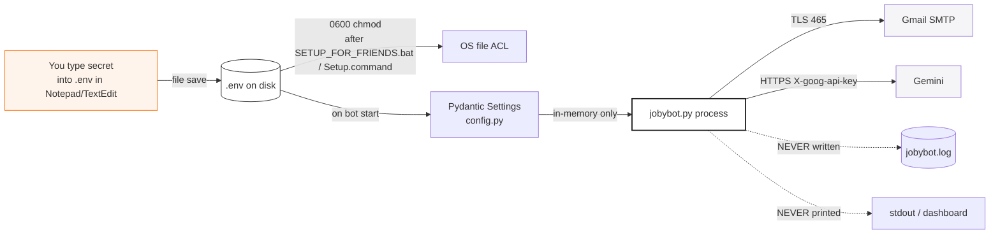
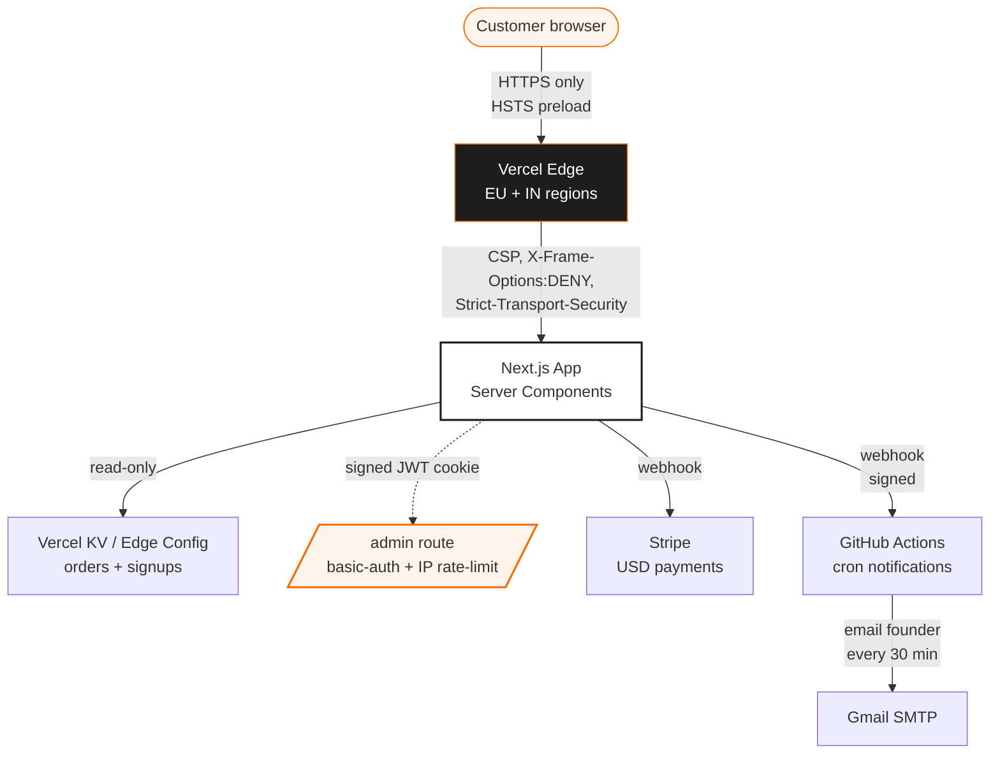

# JobyBots — Security Architecture

> JobyBots handles three things you really do not want leaked: your
> **résumé**, your **Gmail App Password**, and your **AI API keys**. This
> document is the honest story of how we keep them safe.

---

## 1. Threat model (what could go wrong)

| Threat | Impact | Our mitigation |
|---|---|---|
| Someone else on your laptop reads `.env` | Gmail compromise, AI quota theft | `chmod 600` on Unix, `icacls /inheritance:r /grant:r %username%:F` on Windows (`SECURITY_CHECK.bat`) |
| You accidentally commit `.env` to GitHub | Public Gmail credentials | `.env` is in `.gitignore` at the top of the repo |
| Network attacker MITMs your traffic | Stolen Gmail password, résumé exfil | All outbound HTTP uses TLS; Gmail SMTP uses 465/TLS; Gemini uses HTTPS |
| Phishing recruiter email tricks the bot | Spam reputation hit | MX-record validation before send, IMAP NDR scanner quarantines bouncers |
| Malicious dependency injected via pip | Code execution | Pinned versions in `python-deps.txt`, no auto-updates |
| Bot does something annoying (rate-limit ban) | LinkedIn / Gmail throttle | 30–120 s send jitter, 200/day cap, 8 source isolation |
| GDPR-protected recruiter gets cold-emailed | Legal exposure | EU / UK / Sweden markets ship with `gdpr_strict: true` — bot skips email and only generates apply-via-website links |
| Owner's website gets hacked & download leaks | Source code shared without payment | Codebase has zero secret value (no proprietary scraping deals); customer .env never lives on the server |
| Customer payment screenshot uploaded with PII | Bank account leak | Stored only in `data/payment_screenshots/`; never indexed; admin-only access |
| Founder loses laptop with admin DB | Customer list exposure | DB encrypted at rest via BitLocker (Win) / FileVault (Mac); admin password rotated yearly |

---

## 2. Data classification

| Class | Examples | Where it lives | How it's protected |
|---|---|---|---|
| **Secrets** | `GMAIL_APP_PASSWORD`, `GEMINI_API_KEY` | `.env` on your laptop only | 0600 file mode, `.gitignore`, never logged |
| **PII (yours)** | résumé.pdf, name, phone, LinkedIn URL | Your laptop only | Same as secrets |
| **PII (recruiters)** | name@company.com, public profile | `data/jobybot.db` | SQLite, MX-validated, never re-sold |
| **Operational** | jobs scraped, match scores, run log | `data/jobybot.db` + `data/jobybot.log` | Local files, rotation enabled |
| **Public marketing** | dashboard.com static pages | Vercel CDN | Standard HTTPS, security headers |

---

## 3. Secrets handling



**Three rules** the bot enforces:

1. Secrets are read from `.env` exactly once at startup.
2. Secrets never appear in `data/jobybot.log` (loguru sinks redact via
   format string — no `{settings}` ever logged).
3. Secrets never appear in the local web dashboard (templates render
   from a sanitized projection of `Settings`).

---

## 4. Filesystem hardening — what `SECURITY_CHECK.bat` does

On Windows (run anytime, idempotent):

```powershell
# 1. Block inheritance + grant only the current user FULL on .env
icacls ".env"        /inheritance:r /grant:r "%username%:F"
icacls "resume.pdf"  /inheritance:r /grant:r "%username%:F"

# 2. Same for the data/ folder (DB + logs)
icacls "data"        /inheritance:r /grant:r "%username%:(OI)(CI)F" /T

# 3. Verify .gitignore covers everything sensitive
findstr /B "\.env"        .gitignore
findstr /B "data/"        .gitignore
findstr /B "\*\.pdf"      .gitignore
```

On macOS (`mac/Setup.command`):

```bash
chmod 600 .env *.pdf
chmod -R 700 data/
```

---

## 5. Network traffic

Every byte JobyBots sends:

| Destination | Protocol | Port | What we send |
|---|---|---|---|
| `linkedin.com/jobs/search` | HTTPS | 443 | search query + UA header |
| `indeed.com/jobs` | HTTPS | 443 | search query + UA header |
| `naukrigulf.com`, `bayt.com`, `gulftalent.com`, `remoteok.com` | HTTPS | 443 | search query + UA header |
| `boards-api.greenhouse.io`, `api.lever.co`, `apply.workable.com`, `api.ashbyhq.com` | HTTPS | 443 | public job-board reads |
| `generativelanguage.googleapis.com` | HTTPS | 443 | (résumé summary + JD) + `X-goog-api-key` header |
| `smtp.gmail.com` | SMTPS | 465 | TLS 1.2, app-password login, your custom email |
| `imap.gmail.com` | IMAPS | 993 | read-only bounce scan |

**What we never send anywhere:** your résumé as a file, your password
(only the App Password ever, only over TLS, only to Gmail), your Gemini
key (sent only to Google, never logged), or your bank/payment data
(JobyBots never touches it — that's the website's job).

---

## 6. Email-deliverability safeguards

The fastest way to get your Gmail flagged is to blast unverified
addresses. JobyBots prevents that with three layers:

1. **Syntax + DNS pre-check** (`core/email_validator.py`)
   - regex check, then `dns.resolver` query for MX record.
   - Result cached in `validation_cache` SQLite table — same email checked
     once per 30 days.
2. **MX-based domain lookup** (`core/email_finder.py`)
   - If we don't have a recruiter address, we try `careers@{domain}`,
     `jobs@{domain}`, then standard guesses.
   - **No guessing** of personal mailboxes (no `firstname.lastname@`)
     — too risky for deliverability.
3. **Bounce scanner** (`core/bounce_tracker.py`)
   - Every cycle reads Gmail IMAP for Mailer-Daemon replies.
   - Parses NDR codes (550, 553, 5xx) → `invalid_emails` table.
   - That address is **permanently** skipped on future cycles.

Plus the human-pace timing:

- 30–120 s jitter between sends.
- 200/day hard cap (`DAILY_EMAIL_CAP` in `.env`).
- Per-recruiter cooldown — same address never gets a second email within
  `FOLLOWUP_DAYS` (default 7).

---

## 7. GDPR & regional compliance

Each country market JSON (`markets/secondary_<country>.json`) carries a
`gdpr_strict` flag. When true, JobyBots **does not send any email** to
that market — it only generates an `apply-via-website` link on the daily
HTML inbox. Default flag values:

| Market | `gdpr_strict` | Why |
|---|---|---|
| UAE, KSA, Qatar | false | No commercial-email pre-consent law for B2B |
| Singapore | false | PDPA allows B2B with opt-out footer |
| Germany, Netherlands, Ireland, Sweden | **true** | GDPR + national e-comm law require prior consent |
| UK | **true** | PECR requires prior consent for non-existing customer |
| Canada | false (B2B carve-out per CASL) | with opt-out footer |
| India | false | DPDP law allows B2B outreach |

Every outgoing email includes a one-click opt-out line and the founder's
real phone number. No tracking pixels, no UTM, no read-receipts.

---

## 8. Website security architecture



Key controls:

- **CSP**: `default-src 'self'` + explicit allow-list for Stripe/Vercel/Plus Jakarta fonts.
- **CAA DNS record**: only Let's Encrypt + Vercel can issue certs for `jobybots.com`.
- **SPF / DKIM / DMARC**: set on `jobybots.com` so transactional email never lands in spam.
- **Admin route**: HTTP basic-auth (login page) → signed JWT cookie → IP rate-limit 10/min.
- **Suspicious-activity hook**: GitHub Actions every 30 min scans Vercel logs for repeated 4xx — emails owner.
- **Secret rotation**: every quarter, the owner regenerates `ADMIN_PASSWORD` + `STRIPE_WEBHOOK_SECRET` (script in `scripts/rotate_secrets.py`, not yet auto-pushed).

---

## 9. Incident response — what to do if…

### …a customer reports a bounce

1. They run `py -3 scripts/check_bounces.py` — DB shows the dead address.
2. Address is auto-quarantined; no manual step required.
3. Customer can run `RUN_BOT_NOW.bat` again immediately.

### …a customer's Gmail gets a "suspicious activity" warning

1. They open https://myaccount.google.com → Security → recent activity.
2. They see "JobyBots from <city>" → confirm it's them.
3. They lower `DAILY_EMAIL_CAP` to 100 in `.env` for two weeks.
4. Email tharakesh.iitp@gmail.com — we tighten the source for them.

### …the website is defaced / down

1. Owner email + WhatsApp pings within 1 min via GitHub Actions cron alert.
2. Vercel "Instant Rollback" reverts to the previous deploy in 30 sec.
3. Customers already paid? They still have their downloaded `.zip` —
   the bot keeps working with zero website availability.

### …a vulnerability is reported

Email **tharakesh.iitp@gmail.com** with subject `[security] <summary>`.
Confirmed within 24 h. Patched within 7 days for high-severity, 30 days
otherwise. Reporter is credited (or anonymous if you prefer) in
`docs/SECURITY_CREDITS.md`.

---

## 10. What we deliberately don't do

- **No telemetry, no analytics in the bot.** The bot does not ping
  jobybots.com after install. We don't know if you're running it.
- **No auto-update.** The bot you bought stays the version you bought.
  We email release notes if you opt in; you choose whether to upgrade.
- **No customer data on our servers.** The website only stores: your
  email, phone, payment screenshot (until refund window closes), and a
  flag for "received the download". That's it.

If we ever change any of this, we'll write you first. Promise on a 7-day
refund.
